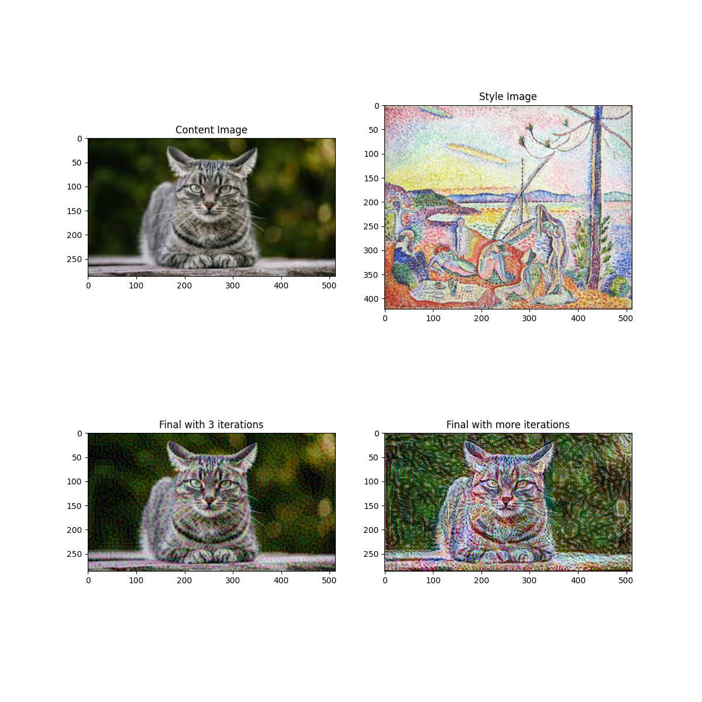
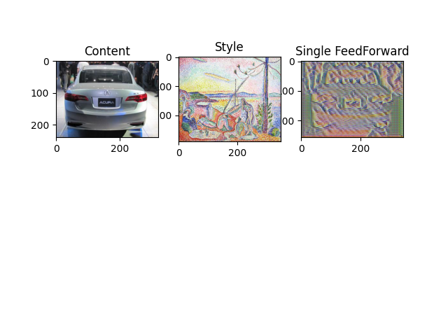
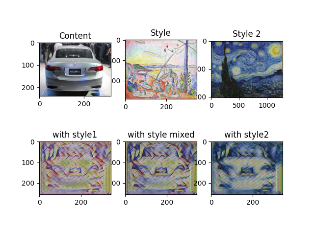
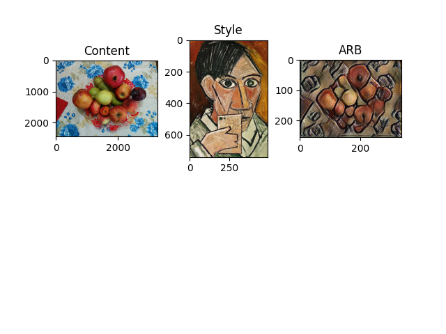

# 701-Project
Name: Ding Pang  Mark Wu

# Topic: Exploring Models of Neural Style Transfer (NST)

## Results:
### Gatys' model

### Single Style Feedforward model

### Multiple Styles Feedforward model

### Arbitrary (kind of) Styles Feedforward model


## Requirements:
```bash
pip install -r requirements.txt
```
### Important Versions:
1. Python: 3
1. tensorflow: 2.4.1 (Cannot be v1)

## How to use:
1. First, change the IN_Method in style.py to select the desired model
1. ```bash
cd Feed_Forward/
python3 style.py
```
